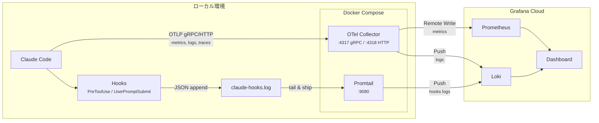
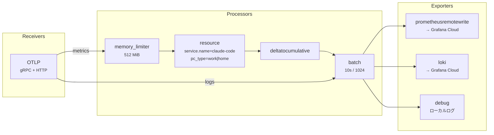
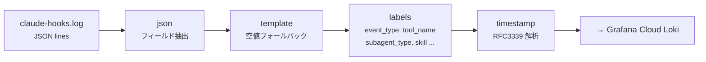
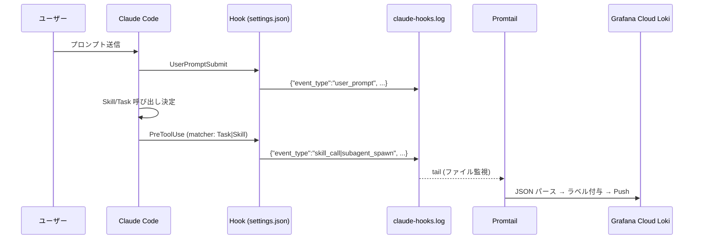
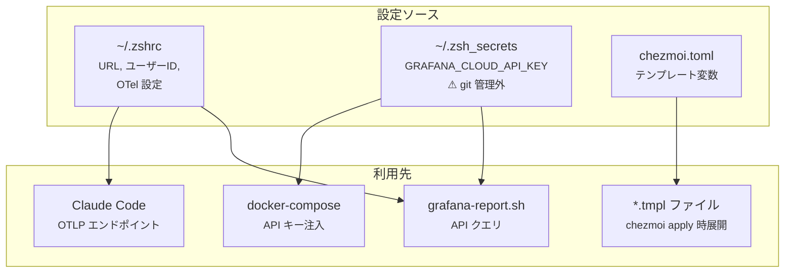

# Claude Code OpenTelemetry モニタリング環境 (Grafana Cloud)

Claude Code の OpenTelemetry メトリクス・ログを Grafana Cloud に送信し、
Hooks ログ（Tool/Skill/Subagent 呼び出し）も Promtail 経由で Loki に記録する構成。

## アーキテクチャ



## ファイル構成

```
dot_config/claude-otel-monitoring/
├── README.md                          # このファイル
├── docker-compose.yml.tmpl            # Docker Compose 定義（chezmoi テンプレート）
├── otel-collector-config.yaml.tmpl    # OTel Collector パイプライン設定
├── promtail-config.yaml.tmpl          # Promtail ログ収集設定
├── executable_manage.sh               # ライフサイクル管理スクリプト
├── logs/                              # Hooks ログ出力先（Docker にマウント）
│   └── claude-hooks.log
└── dashboard-backup/
    └── claude-code.json               # Grafana ダッシュボード JSON バックアップ
```

## Docker コンテナ

### OTel Collector (`claude-otel-collector`)

| 項目 | 値 |
|------|-----|
| イメージ | `otel/opentelemetry-collector-contrib:0.120.0` |
| ポート | gRPC: `4317`, HTTP: `4318`, メトリクス: `8888` |
| 認証 | `GRAFANA_CLOUD_API_KEY` を Docker 環境変数で注入、設定内で `${GRAFANA_CLOUD_API_KEY}` として参照 |

**パイプライン**:



| Processor | 役割 |
|-----------|------|
| `memory_limiter` | メモリ使用量を 512 MiB に制限 |
| `resource` | `service.name=claude-code`, `pc_type` ラベル付与 |
| `deltatocumulative` | Claude Code の Delta メトリクスを Cumulative に変換（`rate()` / `increase()` が使えるようになる） |
| `batch` | 10 秒 or 1024 件でバッチ処理 |

### Promtail (`claude-promtail`)

| 項目 | 値 |
|------|-----|
| イメージ | `grafana/promtail:2.9.4` |
| 起動オプション | `-config.expand-env=true`（設定ファイル内で環境変数展開） |
| 認証 | `GRAFANA_CLOUD_API_KEY` を Docker 環境変数で注入、設定内で `${GRAFANA_CLOUD_API_KEY}` として参照 |

**ログパイプライン**:



**認証方式の注意**: パスワードは `${GRAFANA_CLOUD_API_KEY}`（Docker ランタイム環境変数）で解決する。
chezmoi テンプレート `{{ env "..." }}` は `chezmoi apply` 時に環境変数が未設定だと空になるため使わない。

## Hooks ログ

Claude Code の Hooks（`~/.claude/settings.json`）でツール呼び出しを記録する。



### イベント種別

| フック | event_type | 記録内容 |
|--------|-----------|---------|
| `UserPromptSubmit` | `user_prompt` | session_id, project, prompt_length, summary |
| `PreToolUse` (matcher: `Task\|Skill`) | `subagent_spawn` | tool_name=Task, subagent_type, description |
| `PreToolUse` (matcher: `Task\|Skill`) | `skill_call` | tool_name=Skill, skill名, args |

### Loki でのクエリ例

```logql
# Skill 種別ごとの呼び出し回数（24h）
sum by (skill) (count_over_time({job="claude-hooks",tool_name="Skill"}[24h]))

# Subagent 種別ごとの起動回数（24h）
sum by (subagent_type) (count_over_time({job="claude-hooks",tool_name="Task"}[24h]))

# 全 Hooks イベントの種別分布
sum by (event_type) (count_over_time({job="claude-hooks"}[24h]))
```

## 環境変数



### `~/.zshrc` に設定

```bash
# Claude Code テレメトリ有効化
export CLAUDE_CODE_ENABLE_TELEMETRY=1
export OTEL_METRICS_EXPORTER=otlp
export OTEL_LOGS_EXPORTER=otlp
export OTEL_EXPORTER_OTLP_PROTOCOL=grpc
export OTEL_EXPORTER_OTLP_ENDPOINT=http://localhost:4317

# Grafana Cloud 接続情報
export GRAFANA_LOKI_URL="https://..."
export GRAFANA_LOKI_USER="..."
export GRAFANA_PROMETHEUS_URL="https://..."
export GRAFANA_PROMETHEUS_USER="..."
```

### `~/.zsh_secrets` に設定（git 管理外）

```bash
export GRAFANA_CLOUD_API_KEY="glc_..."
```

### chezmoi テンプレート変数（`~/.config/chezmoi/chezmoi.toml`）

```toml
[data.grafana_cloud]
prometheus_url = "https://..."
prometheus_user = "..."
loki_url = "https://..."
loki_user = "..."
```

## PC 種別の判定

`~/.is_work_pc` ファイルの有無で自動判定：
- ファイルあり → `pc_type=work`
- ファイルなし → `pc_type=home`（デフォルト）

OTel Collector・Promtail 両方でラベルとして付与される。

## Prometheus メトリクス

| メトリクス | 説明 | 主要ラベル |
|-----------|------|-----------|
| `claude_code_cost_usage_USD_total` | コスト（USD） | `model`, `pc_type` |
| `claude_code_token_usage_tokens_total` | トークン数 | `model`, `type`, `pc_type` |
| `claude_code_active_time_seconds_total` | アクティブ時間 | `pc_type` |
| `claude_code_session_count_total` | セッション数 | `pc_type` |
| `claude_code_commit_count_total` | コミット数 | `pc_type` |
| `claude_code_lines_of_code_count_total` | コード行数 | `pc_type` |

トークンの `type` ラベル値: `input`, `output`, `cacheRead`, `cacheCreation`

## 起動・停止

```bash
cd ~/.config/claude-otel-monitoring

./manage.sh start     # 起動
./manage.sh stop      # 停止
./manage.sh restart   # 再起動
./manage.sh status    # ステータス確認
./manage.sh logs      # 全サービスログ
./manage.sh logs promtail  # Promtail ログのみ
./manage.sh health    # ヘルスチェック
```

## レポート生成

```bash
# 詳細レポート（デフォルト: 24h, 全PC）
zsh ~/.claude/skills/grafana-cloud/grafana-report.sh

# PC 種別・期間指定
zsh ~/.claude/skills/grafana-cloud/grafana-report.sh home 7d
zsh ~/.claude/skills/grafana-cloud/grafana-report.sh work 30d
```

## ダッシュボード

`dashboard-backup/claude-code.json` に Grafana ダッシュボードの JSON バックアップがある。
Grafana Cloud → Dashboards → Import → JSON 貼り付けでインポート可能。

## トラブルシューティング

### Promtail が 401 Unauthorized

パスワードが空になっている可能性がある。展開後の設定を確認：

```bash
grep password ~/.config/claude-otel-monitoring/promtail-config.yaml
# → ${GRAFANA_CLOUD_API_KEY} であること（空でないこと）
```

原因: chezmoi テンプレート `{{ env "..." }}` は apply 時の環境変数に依存する。
Docker コンテナ内の認証には必ずランタイム環境変数 `${GRAFANA_CLOUD_API_KEY}` を使う。

### OTel Collector がデータを送信しない

```bash
./manage.sh logs otel-collector
echo $GRAFANA_CLOUD_API_KEY
echo $OTEL_EXPORTER_OTLP_ENDPOINT
```

### Hooks ログが Loki に届かない

```bash
# ローカルログが記録されているか
tail -5 ~/.config/claude-otel-monitoring/logs/claude-hooks.log

# Promtail がログを読んでいるか
docker logs claude-promtail --tail 10

# JSON が1行1エントリか（複数行だとパース失敗）
wc -l ~/.config/claude-otel-monitoring/logs/claude-hooks.log
```

### Grafana Cloud にメトリクスが表示されない

1. API キーの権限を確認（MetricsPublisher + LogsPublisher が必要）
2. OTel Collector ログで認証エラーがないか確認
3. `curl -sf http://localhost:8888/metrics` で Collector が稼働しているか確認
